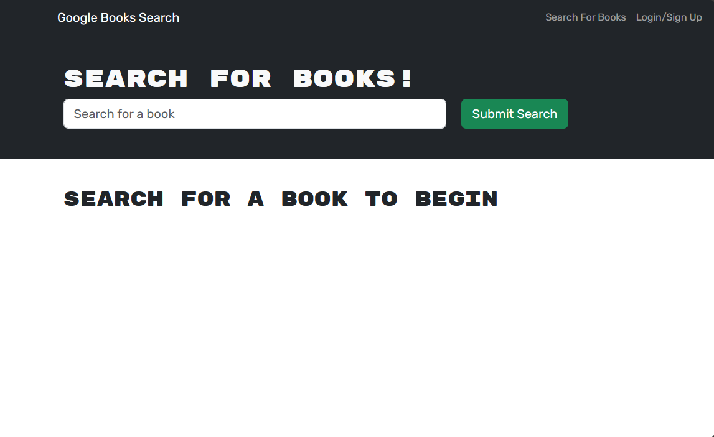

# Book search 
   https://main--jade-otter-d965d3.netlify.app/
   https://github.com/Jelu113/book-retriever

 ## Table of Contents
-[Description](#description)  
-[Installation](#installation)  
-[Usage](#usage)  
-[Credits](#credits)  

 ## Description
 

 to complete a react application using an API and learn how to update a server from SQL to noSQL.
 
 The purpose of this application is to help people find books. 

## Usage

## Credits
I had help from a TA on this project.

